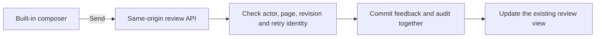

# Hosted review without repeat confirmation

The built-in composer already shows the exact comment, target, screenshot, and
mentions. Its Send action should commit that feedback and show the result in the
same view. A separate browser tab repeats the decision and loses the draft before
the save succeeds.

## Behavioral specification

- Given a signed-in reviewer in a hosted Shiplet or the dashboard preview, when
  they send built-in feedback, then the comment saves inline, the count updates,
  and no confirmation tab opens.
- Given a failed or uncertain save, when the request fails, then the comment,
  capture, and mentions remain available. Retrying the same payload uses the same
  client ID and cannot produce a second ticket.
- Given a changed active revision or a retry with a changed payload, when the
  request reaches persistence, then it cannot commit under the original intent.
- Given an opaque artifact, custom widget, external website, or API credential,
  when it attempts the hosted inline operation, then it cannot acquire ambient
  human authority. The inline route requires same-origin JSON, current review
  membership, and the existing browser session or scoped HttpOnly tenant cookie.
- Given an existing valid browser session, when ordinary `/auth/login` is reached
  during artifact-access recovery, then the existing safe return flow reuses that
  session. Explicit invitation acceptance and adding an account keep their
  dedicated flows. Expired sessions still require sign-in.

The implementation reuses the existing confirmation intent and transactional
effect fence. It does not add a second persistence system or lengthen credential
lifetimes. Custom-widget/workflow requests and reviews embedded on external
websites retain their separate trusted confirmation; an external page controls
the surrounding frame and can disguise or overlay it.

## Verification

Pending implementation and executable checks. This document states the intended
behavior; it is not evidence of deployed behavior.
