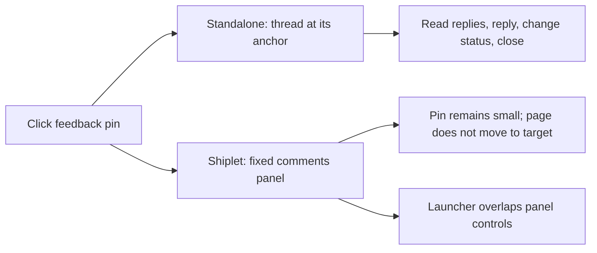

# Annotation and page review parity audit

Audit date: 2026-09-17. Baseline: the currently served production frontend bundles
for both Shiplet and standalone Preview Feedback. This revision supersedes the
initial comparison against local working trees.

Shiplet's hosted review experience does **not** yet meet the standalone Preview
Feedback widget's behavioral baseline. The missing expandable bubble is one part
of a larger gap in contextual threads, page identity, drawing tools, and recovery.
The audit also reproduced correctness defects that should precede feature parity
work: misplaced page feedback, incorrect scrolled screenshots, lost unconfirmed
drafts, overlapping controls, and duplicate in-flight replies after refresh.

This is an audit and acceptance specification. No application behavior was
changed, no feedback was sent to production, and no release is proposed.

Coverage: **56 behavior contracts — 38 gaps (12 P1, 24 P2, 2 P3), 9 passes,
5 ambiguities, 2 blocked integration areas, and 2 non-applicable/withdrawn
requirements.**
P1 blocks a core review interaction or threatens context/draft correctness;
P2 impairs everyday review or omits a substantive baseline capability;
P3 covers optional convenience/preferences.

| Area | Gaps | Pass | Ambiguous | Blocked / not applicable |
| --- | ---: | ---: | ---: | ---: |
| Pins and contextual threads | 10 | 0 | 0 | 1 |
| Page scope/navigation | 7 | 0 | 1 | 0 |
| Creation/drawing/evidence | 7 | 2 | 1 | 0 |
| Writes and recovery | 10 | 5 | 1 | 0 |
| Keyboard/preferences | 4 | 1 | 2 | 0 |
| Boundaries/integration | 0 | 1 | 0 | 3 |

## Focused release acceptance (2026-09-26)

This focused acceptance records a reconciled candidate based on `main` at
`d7a6ed6`. It supersedes the 2026-09-21 **Mandatory residual block** only as
release-blocker policy for this minimal one-submit release. It does not revise
historical ledger statuses, close all 56 contracts, or validate the currently
served production bundles; remaining parity evidence stays open.

| ID / group | Current disposition | Evidence |
| --- | --- | --- |
| Hosted direct one-submit | Accepted for this release slice: held request disables submit; no popup. | `e2e/trusted-review-host.spec.ts` |
| Direct submission retry | Accepted for tested path: committed lost response retries the same nonempty request/client/revision IDs and byte-identical body; one durable row survives reload. | `e2e/feedback-inbox.spec.ts` |
| Rich saved feedback | Accepted for tested path: saved row, pin, selected element, and annotated image pixels survive reload; zero popups. | `e2e/trusted-review-host.spec.ts` |
| WRITE-07 large capture | Accepted for tested path: >2 MiB page-fidelity capture persists and retries saved bytes after the two-cause repair. | `test/trusted-review-host.spec.ts` |
| Concurrent screenshot retry | Accepted for tested path: the durable screenshot retains the winner. | `test/review-rich-confirmation-api.spec.ts` |
| Focused regressions | 116 focused regressions passed. | `test/trusted-review-host.spec.ts`; `test/review-rich-confirmation-api.spec.ts` |

**Gate:** The final full `npm run verify` passed: typecheck; all 2,036 Vitest
tests and 26 Node tests; four Worker dry-runs; license audit; and security audit
with 0 vulnerabilities. Browser retry04 and rich06 acceptance also passed.
Release and deployment remain pending; no production behavior is claimed as
validated. This is candidate evidence only; prior production bytes and
deployments remain separate.

**Deferred:** Backend06/Backend11 and UX-07 external-runtime/custom-action
coverage; non-Chromium, touch, assistive-technology, and concurrent-reviewer
browser coverage; BOUND-03/04 authorized integrations; WRITE-15 native-select
gesture; five Wrangler-dependent external-harness mutants. Sandbox Mentions
remains an intentional, recoverable unsupported capability.

## Final canonical reconciliation (2026-09-21)

This is the final canonical ledger reconciliation for the accepted parity boundary. Stable IDs and historical baseline cells remain intact; the tracking cells below record the current evidence-backed disposition. The prior implementation snapshot is retained in the historical row cells and does not override this reconciliation.

**Status vocabulary**

- **Closed — independent local:** the row’s bounded contract is independently proven on the exact current bytes.
- **Accepted local — external validation remains:** source and deterministic local behavior are accepted, while a named runtime, browser engine, device, or Wrangler-dependent probe remains outside the local evidence.
- **Partially accepted — open residual:** a known contract subset is proven but a material behavior remains unproved or blocked; the row is not closed.
- **Regression retained:** behavior predated the parity program and its accepted regression evidence remains green; this update makes no new implementation claim.
- **Excluded — intentional:** the canonical scope intentionally excludes the behavior.
- **Blocked — external:** completion requires authorized external accounts, sites, runtimes, devices, browsers, or accessibility technology.

| Tracking status | Count |
| --- | ---: |
| Closed — independent local | 29 |
| Accepted local — external validation remains | 12 |
| Partially accepted — open residual | 2 |
| Regression retained | 9 |
| Excluded — intentional | 2 |
| Blocked — external | 2 |
| **Total** | **56** |

### Mandatory residual block

1. Backend06 and Backend11 cannot be authoritatively completed in the current local Wrangler/Miniflare/Workerd harness; R3g carries `LOCAL_RUNTIME_OR_HARNESS_RESIDUAL`.
2. UX-07 remains partially open because those two runtime paths are part of its external completion boundary.
3. The R1 editor is accepted in Chromium; equivalent Firefox/WebKit coverage was unavailable locally.
4. BOUND-03 and BOUND-04 require external authorized contexts.
5. WRITE-07 remains open for the actual greater-than-2-MB capture persistence path.
6. Five T2 mutation rows remain Wrangler-dependent: confirmation/completion clearing for rich draft/editor/attachments; stale mention/explicit-ID handling; actor/project preference key; clean-link result; copy-request admission.
7. Direct native-select system-browser gesture evidence for WRITE-15 remains external.
8. Sandbox Mentions is an intentional recoverable unsupported capability, not an empty success and not a hidden stored feature.

### Evidence boundary

Navigation R11, Sandbox Query final, T1, and T2/R3g are the authoritative release reports for this reconciliation. P1/Q2 and the accepted R1/component reports are cited only for the bounded rows they independently cover. Backend06/11 runtime residuals, non-Chromium coverage, native-select gesture proof, the >2 MB capture boundary, and the five named Wrangler-dependent mutation rows remain outside closure.

## Scope and evidence

The baseline is the **downloaded production JavaScript and CSS**, retrieved on
2026-09-17. Local modifications and local HEAD are not the source of truth for
this revision. Both deployed applications differ from their local copies. A
production commit SHA was not established; this is a comparison of the bytes
actually served to reviewers, not an assumption that a Git branch is deployed.

The comparison covers:

- **H:** Shiplet's deployed trusted review host JavaScript and stylesheet.
- **E:** Shiplet's deployed website embed JavaScript and stylesheet, including
  its trusted host frame.
- **S:** the deployed standalone `preview-feedback.js` bundle.
- **Bridge:** Shiplet's deployed artifact capture/viewport bridge.
- **L:** the older local [review-client.ts](../src/review-client.ts), retained
  only as possible implementation context, never as the production baseline.

Browser checks replayed those downloaded assets in headless Chrome with a
synthetic two-page artifact and intercepted API responses. The inert host HTML
and sandbox/CSP fixture were generated by the existing local response helper;
all widget, review-host, embed, and bridge behavior used the downloaded bundles.
Desktop was 1280 × 800; a narrow viewport was 390 × 844. This verifies deployed
frontend behavior under the stated fixture, not the live backend or production
HTML/authentication configuration. No production feedback was submitted.

**B** means a browser reproduction with downloaded production assets; **C** means
inspection of those assets. Local source links are implementation pointers only:
they do not certify the live server's query, authorization, or persistence
behavior. High confidence means a browser reproduction or an explicit frontend
control/protocol contract. Medium confidence identifies interpretation or an
unexercised integration. Earlier local test results are separated below.

## What changed after switching to production

| Earlier conclusion or omission | Production comparison and correction |
| --- | --- |
| Closing the website embed destroys reply drafts. | Withdrawn for normal Comments close/reopen: the persistent frame retains the draft (WRITE-16). SPA route replacement still loses it (WRITE-06), and confirmation handoff still clears uncommitted text (WRITE-05). |
| Offscreen pins should remain clamped to the viewport edge. | Withdrawn (PIN-06). S intentionally hides offscreen and hidden targets, then scrolls to offscreen targets from the list. Shiplet's missing reveal action remains PIN-04; visible pins on hidden targets are PIN-11. |
| The standalone copy-edit feature is only a host-supplied extension. | Incomplete. Production includes optional built-in text/template editing and image replacement with a combined request flow (CREATE-10). It is enabled by configuration, not on every installation. |
| Five workflow statuses cover parity. | Production S also offers **Staging**; H/E do not (WRITE-15). |
| Shiplet's embed is an outer Feedback button and expanded form. | Production has a persistent trusted toolbar, compact anchored composer, separate view sizing, a direct Draw on screenshot button, and access rechecking before annotation. These improvements are already present. |
| Multiplayer covers only basic presence. | The deployed host and bridge also contain live cursors, follow-reviewer viewport commands, and Stop following controls. Real multi-user integration remains unverified. |
| Standalone attachments might only be local modifications. | They are in production: photos/video, limits, previews, removal, and drag/drop remain an applicable gap (CREATE-05). |
| Basic pin expansion describes the standalone target fully. | Production also improves keyboard-accessible stack fan-out, focus retention, edge placement, launcher collision avoidance, and status confirmations. Acceptance should use this newer behavior. |

The central bubble gap and the reproduced page-context, capture, pending-reply,
launcher-overlap, confirmation, and SPA-navigation defects all remain with the
production frontend assets.

The common actor is an authorized reviewer. Each row states additional data or
surface preconditions. The user goal is expressed by the expected outcome.
All fix references and post-fix retest evidence are **not applicable yet: audit
only**. Keep these IDs in subsequent regression tests and fixes.

Browser harnesses, raw results, and screenshots were kept outside the repository
in `/tmp/shiplet-review-parity-audit/`. Three production-replay images (standalone
expanded thread, Shiplet pin/panel, and scrolled capture) were shown in the task
conversation, separately from the five initial local images. Reproduction steps
below remain useful after those temporary files expire.

## The central workflow gap



Shiplet can already render and mutate threads in the trusted document. The next
step is to connect that thread state to a contextual bubble and a reliable
artifact-navigation/anchor protocol. Preserve the existing trusted write and
confirmation boundaries while doing so.

## Canonical behavior ledger

### Pins and contextual threads

| ID | Surface and expected behavior | Observed behavior | Status / severity | Evidence | Confidence | Scope | Owner | Fix reference | Independent retest evidence | Current tracking |
| --- | --- | --- | --- | --- | --- | --- | --- | --- | --- | --- |
| PIN-01 | H/E: Given a saved pin, clicking it expands a nearby thread with comment, replies, reply composer, status, and close. | S expands a contextual card. H/E open the fixed panel; H only scales its 28 px pin to about 31 px. | fail / P1 | B `baseline-inline`, `inline-bubble`; H `render`, `setActiveThread`; S `renderExpandedBubble` | High | in_scope / accepted-local | final reconciliation / independent local | P1-R; Navigation R11 | /private/tmp/shiplet-parity-verification-p1-20260920/report.md; /private/tmp/shiplet-parity-navigation-final-acceptance.md — residual: none. | Closed — independent local — Historical baseline observation is retained above; current cited evidence controls this bounded disposition. |
| PIN-02 | H/E: Given two comments on the same target, each pin remains independently reachable by pointer and keyboard. | H places both at exactly the same coordinates. E also lacks stacking/fan-out. Production S fans stacks left/right to fit the viewport, expands on hover/focus, and delays collapse. | fail / P1 | B `overlapping-pins`; C H `reviewCoordinates`; E `positionPins`; S `getStackFanDirection`, `updateRenderedBubbleStacks` | High | in_scope / accepted-local | final reconciliation / independent local | Navigation R11 | /private/tmp/shiplet-parity-navigation-final-acceptance.md — residual: none. | Closed — independent local — Historical baseline observation is retained above; current cited evidence controls this bounded disposition. |
| PIN-03 | H: Given a saved target that moves or reflows, its pin follows the target. | Moving the target down 220 px leaves its saved pin unchanged, including after viewport resize. Only the pending composer has a live element-anchor protocol. E already re-resolves saved selectors. | fail / P1 | B `saved-anchor-reflow`; H `reviewCoordinates`; bridge `postArtifactPosition`; E `positionPins` | High | in_scope / accepted-local | final reconciliation / independent local | Navigation R11 | /private/tmp/shiplet-parity-navigation-final-acceptance.md — residual: none. | Closed — independent local — Historical baseline observation is retained above; current cited evidence controls this bounded disposition. |
| PIN-04 | H/E: Given an offscreen thread, selecting it from the list or stepping to it reveals the annotated page element. | H only scrolls the list row; the artifact remains at scrollY 0 for a target around pageY 1650. E's focus message opens the thread without scrolling the host page. | fail / P1 | B `thread-scroll`; H `scrollToThread`, embedded focus handler; S `scrollToComment` | High | in_scope / accepted-local | final reconciliation / independent local | Navigation R11 | /private/tmp/shiplet-parity-navigation-final-acceptance.md — residual: none. | Closed — independent local — Historical baseline observation is retained above; current cited evidence controls this bounded disposition. |
| PIN-05 | H/E: Given ticket PF-7, its pin displays a stable ticket reference. | The first rendered PF-7 pin displays `1`. Labels change with list ordering; E also uses array index. | fail / P2 | B `ticket-label`; H `pin.textContent`; E `renderPins`; S `getCommentReference` | High | in_scope / accepted-local | final reconciliation / independent local | P1-R; Navigation R11 | /private/tmp/shiplet-parity-verification-p1-20260920/report.md; /private/tmp/shiplet-parity-navigation-final-acceptance.md — residual: none. | Closed — independent local — Historical baseline observation is retained above; current cited evidence controls this bounded disposition. |
| PIN-06 | Withdrawn: offscreen targets must keep a pin at the viewport edge. | This is not the production baseline. S hides offscreen pins via `resolveCommentPagePosition(comment, false)`; its layout clamp applies to eligible visible pins/cards. E hiding offscreen pins is not itself a defect. Use PIN-04 for list-to-target reveal. | not applicable / withdrawn | B `baseline-offscreen-target`; C S `resolveBubblePosition`, `getBubbleViewportLayout` | High | excluded / intentional | excluded / intentional | — | Not applicable; intentional product boundary. | Excluded — intentional — intentional withdrawal; outside canonical scope. |
| PIN-07 | H/E: Given a general comment without coordinates, it remains discoverable in the page's visual feedback controls. | It is list-only; pin creation requires coordinates. S gives general comments a fallback position. | fail / P2 | C H `reviewCoordinates`, `render`; S `buildFeedbackPayload`, `getFallbackBubblePosition` | High | in_scope / accepted-local | final reconciliation / independent local | Navigation R11 | /private/tmp/shiplet-parity-navigation-final-acceptance.md — residual: none. | Closed — independent local — Historical baseline observation is retained above; current cited evidence controls this bounded disposition. |
| PIN-08 | H/E: While inspecting the artifact, the reviewer can hide comments/pins and restore them. | No independent pin-visibility control exists. H/E retain pins when Comments closes. Production E retains its frame rather than destroying the widget. S has Hide comments. | fail / P2 | B control inventory; C H controls; E `renderPins`, `positionPins`; S `renderCommentTray` | High | in_scope / accepted-local | final reconciliation / independent local | Navigation R11 | /private/tmp/shiplet-parity-navigation-final-acceptance.md — residual: none. | Closed — independent local — Historical baseline observation is retained above; current cited evidence controls this bounded disposition. |
| PIN-09 | H: Opening comments exposes usable thread rows and reply controls, on desktop and narrow viewports. | The higher-z-index launcher overlays the panel. At desktop it intercepts the center of the only collapsed row and the reply Send button. Narrow view permits the Send center tap but still overlaps its right side. | fail / P1 | B `collapsed-row-obscured`, `reply-send-obscured`, `mobile-reply-send`; screenshots; H `setPanelOpen`, launcher/panel styles | High | in_scope / accepted-local | final reconciliation / independent local | P1-R; Navigation R11 | /private/tmp/shiplet-parity-verification-p1-20260920/report.md; /private/tmp/shiplet-parity-navigation-final-acceptance.md — residual: none. | Closed — independent local — Historical baseline observation is retained above; current cited evidence controls this bounded disposition. |
| PIN-10 | H/E: A collapsed thread communicates its current status. | Summary displays author, time, ticket, text; no visible status. The status select is behind two disclosures. S shows status in its list summary. | fail / P2 | C H `render`; S `renderCommentListPanel` | High | in_scope / accepted-local | final reconciliation / independent local | Q2 | /private/tmp/shiplet-parity-verification-q2-20260920/report.md — residual: none. | Closed — independent local — Historical baseline observation is retained above; current cited evidence controls this bounded disposition. |
| PIN-11 | H/E: Hidden or non-rendered targets do not leave misleading visible pins. | S rejects hidden, zero-size and offscreen targets. H retains a visible pin after its target becomes `display:none`; E resolves target bounds without matching S’s visibility checks. | fail / P2 | B `hidden-target-pin`, `baseline-hidden-target`; C S `resolveCommentPagePosition`; H `reviewCoordinates`; E `positionPins` | High for H; source-only for E | in_scope / accepted-local | final reconciliation / independent local | Navigation R11 | /private/tmp/shiplet-parity-navigation-final-acceptance.md — residual: none. | Closed — independent local — Historical baseline observation is retained above; current cited evidence controls this bounded disposition. |

### Page review scope and navigation

| ID | Surface and expected behavior | Observed behavior | Status / severity | Evidence | Confidence | Scope | Owner | Fix reference | Independent retest evidence | Current tracking |
| --- | --- | --- | --- | --- | --- | --- | --- | --- | --- | --- |
| PAGE-01 | H: Given comments from two pages of one Shiplet, only the current page’s comments become pins on that page. | H requests `includeClosed=true` without a page filter and renders both supplied records. E carries its bound page URL. The current live backend’s response scoping was not exercised. | fail / P1 | B `page-filter`; C H `request`; local server pointers: [review query](../src/review.ts:709), [routes](../src/index.ts) | High for client behavior | in_scope / accepted-local | final reconciliation / independent local | Q2; Sandbox Query R21 | /private/tmp/shiplet-parity-verification-q2-20260920/report.md; /private/tmp/shiplet-parity-navigation-final-acceptance.md; /private/tmp/shiplet-parity-verification-sandbox-query-final-20260921/report.md — residual: none. | Closed — independent local — Historical baseline observation is retained above; current cited evidence controls this bounded disposition. |
| PAGE-02 | H: After navigation inside the artifact, new comments identify the page actually being reviewed. | The artifact reached `/artifact/next`, but confirmation still submitted the original `/demo` review URL and showed its old label. The host captures `reviewPageUrl` once; the bridge has no route message. SPA navigation has the same structural gap. | fail / P1 | B `navigation-context`; H initialization, `offerArtifactChannel`, `submitTopLevelConfirmation`; bridge message schema | High | in_scope / accepted-local | final reconciliation / independent local | Navigation R11; Sandbox Query R21 | /private/tmp/shiplet-parity-verification-q2-20260920/report.md; /private/tmp/shiplet-parity-navigation-final-acceptance.md; /private/tmp/shiplet-parity-verification-sandbox-query-final-20260921/report.md — residual: none. | Closed — independent local — Historical baseline observation is retained above; current cited evidence controls this bounded disposition. |
| PAGE-03 | H/E: Reviewers can choose the equivalent of S's branch scope and understand which revision old feedback belongs to. | H displays a revision label but has no comment revision filter or provenance per row. S has persisted branch selection. Shiplet revisions and standalone branches need an explicit mapping before copying this behavior. | ambiguous / P2 | C H `render`, review query; S `renderCommentTray`, `normalizeCommentBranch` | Medium | in_scope / accepted-local | final reconciliation / independent local | Q2; Sandbox Query R21 | /private/tmp/shiplet-parity-verification-q2-20260920/report.md; /private/tmp/shiplet-parity-navigation-final-acceptance.md; /private/tmp/shiplet-parity-verification-sandbox-query-final-20260921/report.md — residual: none. | Closed — independent local — Historical baseline observation is retained above; current cited evidence controls this bounded disposition. |
| PAGE-04 | H/E: Reviewers can intentionally inspect a route and its subroutes together. | S's Sync comments action requests route-prefix hydration. H has an accidental all-project view; E has exact-page scope. Neither offers explicit route-prefix review. | fail / P2 | C S `hydrate` with `scope=route-prefix`; H `request`; E feedback endpoint | High | in_scope / accepted-local | final reconciliation / independent local | Q2; Sandbox Query R21 | /private/tmp/shiplet-parity-verification-q2-20260920/report.md; /private/tmp/shiplet-parity-navigation-final-acceptance.md; /private/tmp/shiplet-parity-verification-sandbox-query-final-20260921/report.md — residual: none. | Closed — independent local — Historical baseline observation is retained above; current cited evidence controls this bounded disposition. |
| PAGE-05 | H/E: Given more than 100 relevant comments, all remain reachable and the count is honest. | 105 returned records become 100 rows, with no pagination/load-more or truncation notice. The deployed host and embed both slice records to 100. Closed records consume this client budget too. | fail / P2 | B `pagination`; C H `render`, `updateCount`; E `renderPins` | High | in_scope / accepted-local | final reconciliation / independent local | Q2; Sandbox Query R21 | /private/tmp/shiplet-parity-verification-q2-20260920/report.md; /private/tmp/shiplet-parity-navigation-final-acceptance.md; /private/tmp/shiplet-parity-verification-sandbox-query-final-20260921/report.md — residual: none. | Closed — independent local — Historical baseline observation is retained above; current cited evidence controls this bounded disposition. |
| PAGE-06 | H/E: Resolving a comment removes it from the default open review queue, with a deliberate route to closed comments. | H/E always include closed comments and keep their pins. No open/closed filter exists. S excludes Done/Dropped/Resolved. | fail / P2 | B `resolved-filter`; H `request`; S `getVisibleComments` | High | in_scope / accepted-local | final reconciliation / independent local | Q2; Sandbox Query R21 | /private/tmp/shiplet-parity-verification-q2-20260920/report.md; /private/tmp/shiplet-parity-navigation-final-acceptance.md; /private/tmp/shiplet-parity-verification-sandbox-query-final-20260921/report.md — residual: none. | Closed — independent local — Historical baseline observation is retained above; current cited evidence controls this bounded disposition. |
| PAGE-07 | H/E: Reviewers can focus on their own comments or mentions. | No My comments or Mentions me controls. S supplies both, plus a failed-sync filter. | fail / P2 | B control inventory; C S settings/getVisibleComments; H controls | High | in_scope / accepted-local | final reconciliation / independent local | Q2; Sandbox Query R21 | /private/tmp/shiplet-parity-verification-q2-20260920/report.md; /private/tmp/shiplet-parity-navigation-final-acceptance.md; /private/tmp/shiplet-parity-verification-sandbox-query-final-20260921/report.md — residual: none. | Closed — independent local — Sandbox Mentions is a truthful recoverable unsupported capability; supported hosted/embed mention behavior is tracked under WRITE-03/04. Historical baseline observation is retained above; current cited evidence controls this bounded disposition. |
| PAGE-08 | H/E: From an inline thread, the reviewer can open its canonical ticket/detail context. | H/E expose no thread link. S links to its canonical Notion record. The Shiplet equivalent should link to its own feedback detail rather than require Notion. | fail / P2 | C H `render`; S `renderExpandedBubble`, `renderCommentListPanel` | High | in_scope / accepted-local | final reconciliation / independent local | Q2; Sandbox Query R21 | /private/tmp/shiplet-parity-verification-q2-20260920/report.md; /private/tmp/shiplet-parity-navigation-final-acceptance.md; /private/tmp/shiplet-parity-verification-sandbox-query-final-20260921/report.md — residual: none. | Closed — independent local — Historical baseline observation is retained above; current cited evidence controls this bounded disposition. |

### Creation, drawing, and evidence

| ID | Surface and expected behavior | Observed behavior | Status / severity | Evidence | Confidence | Scope | Owner | Fix reference | Independent retest evidence | Current tracking |
| --- | --- | --- | --- | --- | --- | --- | --- | --- | --- | --- |
| CREATE-01 | H/E: A reviewer can start a general page comment or drawing without first selecting an element. | Annotate and New comment still start target selection. General comments require select → Details → Remove target. Production’s direct Draw on screenshot shortcut improves access after capture, but remains hidden until a selected capture has an image. S permits a general form and direct drawing. | fail / P2 | B `general-after-target`; C H `beginAnnotation`, `openAnnotationEditor`, `quickDraw`; S `renderPanel` | High | in_scope / accepted-local; external validation remains | final reconciliation / deterministic local | T2/R3g local slice; external browser/runtime gate | /private/tmp/shiplet-parity-verification-tail-t1-recovery-20260921/report.md; /private/tmp/shiplet-parity-verification-tail-t2-r3g-20260921/report.md — residual: external browser/runtime validation remains; named Wrangler-dependent mutation rows are not passed. | Accepted local — external validation remains — external browser/runtime validation remains; named Wrangler-dependent mutation rows are not passed. Historical baseline observation is retained above; current cited evidence controls this bounded disposition. |
| CREATE-02 | H: Selecting an element opens a composer and exposes target/capture context. | Selection opens compact composer; Details exposes selector/text plus viewport, scroll offset, and capture state. | pass | B `target-details`; bridge/host selection flow | High | regression / retained | regression evidence retained | — | Existing accepted regression evidence retained; no new parity implementation claim. | Regression retained — historical regression evidence retained; no new parity implementation claim. |
| CREATE-03 | H: Expanded annotation card can be dragged without moving the selected target. | Browser dragging changes the card position independently. Production E intentionally hides the drag handle and positions its compact frame around the anchor; this pass applies to H. | pass | B `composer-drag`; C deployed embedded styles | High | regression / retained | regression evidence retained | — | Existing accepted regression evidence retained; no new parity implementation claim. | Regression retained — historical regression evidence retained; no new parity implementation claim. |
| CREATE-04 | H/E: Drawing supports free draw, arrows, text boxes, undo, color, and stroke width. | H/E have fixed pink 5 px free draw and Done/Cancel. No arrows, text, movable/resizable text boxes, undo, or appearance controls. S supplies these. | fail / P2 | B `drawing-tools`; H `configureAnnotationContext`, `openAnnotationEditor`; S annotation tools/settings | High | in_scope / accepted-local; external validation remains | final reconciliation / deterministic local | D1a-R; T2/R3g local slice; external browser/runtime gate | /private/tmp/shiplet-parity-verification-d1ar-20260920/report.md; /private/tmp/shiplet-parity-verification-tail-t1-recovery-20260921/report.md; /private/tmp/shiplet-parity-verification-tail-t2-r3g-20260921/report.md — residual: external browser/runtime validation remains; named Wrangler-dependent mutation rows are not passed. | Accepted local — external validation remains — external browser/runtime validation remains; named Wrangler-dependent mutation rows are not passed. Historical baseline observation is retained above; current cited evidence controls this bounded disposition. |
| CREATE-05 | H/E: A reviewer can attach photos/video with preview, removal, limits, and recoverable validation. | No attachment input/drop zone or draft attachment state. Production S supports up to four attachments with per-file/total bounds, previews, removal and drag/drop. | fail / P2 | C H composer/submit payload; S `renderAttachmentControls`, `renderAttachmentDrafts`, `submitFeedback` | High | in_scope / accepted-local; external validation remains | final reconciliation / deterministic local | D3a; T1; T2/R3g local slice; external upload/runtime gate | /private/tmp/shiplet-parity-verification-d3a-20260920/report.md; /private/tmp/shiplet-parity-verification-tail-t1-recovery-20260921/report.md; /private/tmp/shiplet-parity-verification-tail-t2-r3g-20260921/report.md — residual: external browser/runtime validation remains; named Wrangler-dependent mutation rows are not passed. | Accepted local — external validation remains — external browser/runtime validation remains; named Wrangler-dependent mutation rows are not passed. Historical baseline observation is retained above; current cited evidence controls this bounded disposition. |
| CREATE-06 | H/E bridge: Selecting a scrolled element captures the visible viewport. | Production bridge captures at scrollY 1184 and 0 yielded byte-identical images with no failure note. The ordinary DOM clone is rasterized from the top; recorded scroll offsets are not applied. The raster-image special case is separate. | fail / P1 | B `scrolled-capture`; C deployed bridge `domScreenshot`; captured image shown in conversation | High | in_scope / accepted-local | final reconciliation / independent local | T1 R3b; Navigation R11 | /private/tmp/shiplet-parity-verification-tail-t1-recovery-20260921/report.md; /private/tmp/shiplet-parity-navigation-final-acceptance.md — residual: none. | Closed — independent local — Historical baseline observation is retained above; current cited evidence controls this bounded disposition. |
| CREATE-07 | H/E: Before sending, reviewers can understand when evidence is approximate, missing, or different from the visible page. | Capture is labeled image-ready whenever data exists, even for a synthetic fallback. No captured-image preview or failure-note display in the host composer. Clone sanitization removes images, canvas, media, form controls, external stylesheets. Preserve privacy rules while adding honest evidence feedback. | fail / P2 | C bridge `sanitizedClone`, `captureTarget`; H `updateAnnotationProperties`, `showComposer`; CREATE-06 | High | in_scope / accepted-local; external validation remains | final reconciliation / deterministic local | T1; T2/R3g local slice; external capture gate | /private/tmp/shiplet-parity-verification-tail-t1-recovery-20260921/report.md; /private/tmp/shiplet-parity-verification-tail-t2-r3g-20260921/report.md — residual: external browser/runtime validation remains; named Wrangler-dependent mutation rows are not passed. | Accepted local — external validation remains — external browser/runtime validation remains; named Wrangler-dependent mutation rows are not passed. Historical baseline observation is retained above; current cited evidence controls this bounded disposition. |
| CREATE-08 | H/E: Completed markup remains available as structured annotation context for downstream consumers, as in S. | H flattens strokes into screenshot pixels; captureContext contains only dimensions/scroll offsets. S includes `captureContext.screenshotAnnotations`. Adding this requires a bounded schema extension. | fail / P2 | C H `applyAnnotations`, `submitTopLevelConfirmation`; bridge capture schema; S `buildFeedbackPayload` | High | in_scope / accepted-local; external validation remains | final reconciliation / deterministic local | D1a-R; T1; T2/R3g local slice; external H/E gate | /private/tmp/shiplet-parity-verification-tail-t1-recovery-20260921/report.md; /private/tmp/shiplet-parity-verification-tail-t2-r3g-20260921/report.md — residual: external browser/runtime validation remains; named Wrangler-dependent mutation rows are not passed. | Accepted local — external validation remains — external browser/runtime validation remains; named Wrangler-dependent mutation rows are not passed. Historical baseline observation is retained above; current cited evidence controls this bounded disposition. |
| CREATE-09 | H/E: Canceling an annotation has a consistent, explicit draft policy. | H removes target, capture, and markup but retains comment text. S Cancel clears the draft. Retaining text could be intentional, but it can later be attached to a different target without its original evidence. Choose discard-all or preserve the whole contextual draft. | ambiguous / P2 | B `cancel-text`; H `cancelAnnotationFlow`; S `resetFeedbackDraftState` | Medium | in_scope / accepted-local | final reconciliation / independent local | R1 | /private/tmp/shiplet-parity-verification-r1-20260920/report.md — residual: none. | Closed — independent local — Historical baseline observation is retained above; current cited evidence controls this bounded disposition. |
| CREATE-10 | H/E, when copy review is enabled: Reviewers can draft visible text/template changes and image replacements, inspect/remove changes, and submit a combined request. | Production S includes this built-in optional workflow. Shiplet’s deployed review UI has no equivalent. S defaults it off unless configured, so this is capability parity rather than a mandatory action for every page. | fail / P2 | B `baseline-built-in-copy`; C S `normalizeCopyEditConfig`, `startBuiltInCopyEditMode`, `submitBuiltInCopyEdits`; H control inventory | High for capability; downstream integration untested | in_scope / accepted-local; external validation remains | final reconciliation / deterministic local | T1; T2/R3g local slice; external copy-request gate | /private/tmp/shiplet-parity-verification-tail-t1-recovery-20260921/report.md; /private/tmp/shiplet-parity-verification-tail-t2-r3g-20260921/report.md — residual: external browser/runtime validation remains; named Wrangler-dependent mutation rows are not passed. | Accepted local — external validation remains — external browser/runtime validation remains; named Wrangler-dependent mutation rows are not passed. Historical baseline observation is retained above; current cited evidence controls this bounded disposition. |

### Replies, mentions, submission, and recovery

| ID | Surface and expected behavior | Observed behavior | Status / severity | Evidence | Confidence | Scope | Owner | Fix reference | Independent retest evidence | Current tracking |
| --- | --- | --- | --- | --- | --- | --- | --- | --- | --- | --- |
| WRITE-01 | H: Given a successful reply response, the thread shows the reply and clears the sent text. | Works in the generated host. This does not by itself validate production persistence. | pass | B `reply-success` | High | regression / retained | regression evidence retained | — | Existing accepted regression evidence retained; no new parity implementation claim. | Regression retained — historical regression evidence retained; no new parity implementation claim. |
| WRITE-02 | H/E: A follow-up can contain multiple lines. | Reply uses a one-line text input; unmodified Enter submits. S uses a textarea. | fail / P2 | C H `render` reply input/keydown; S follow-up textarea | High | in_scope / accepted-local | final reconciliation / independent local | R1 | /private/tmp/shiplet-parity-verification-r1-20260920/report.md — residual: none. | Closed — independent local — Historical baseline observation is retained above; current cited evidence controls this bounded disposition. |
| WRITE-03 | H/E: Typing @ in comments or replies offers searchable, keyboard-selectable mentions. | H uses a separate select capped at 50 users; there is no inline mention matching, search, or keyboard suggestion flow. E has the additional endpoint gap in WRITE-04. S supports both comment and follow-up suggestions. | fail / P2 | C H `loadMentionUsers`, `populateMentionSelect`; S mention handlers | High | in_scope / accepted-local; external validation remains | final reconciliation / deterministic local | T1; T2/R3g; Sandbox Query R21 local slice; external mention gate | /private/tmp/shiplet-parity-verification-tail-t1-recovery-20260921/report.md; /private/tmp/shiplet-parity-verification-tail-t2-r3g-20260921/report.md; /private/tmp/shiplet-parity-verification-sandbox-query-final-20260921/report.md — residual: Sandbox Mentions remains intentionally recoverable unsupported; external hosted/embed browser/runtime evidence remains. | Accepted local — external validation remains — Sandbox Mentions remains intentionally recoverable unsupported; external hosted/embed browser/runtime evidence remains. Historical baseline observation is retained above; current cited evidence controls this bounded disposition. |
| WRITE-04 | E: Reviewers can select mention recipients and carry them through reply confirmation. | With the embedded API shape, `childApiUrl("mentions")` returns empty; recipient controls remain hidden with zero options. The deployed forwarding form also omits mentions. Current server-side forwarding was not independently inspected. | fail / P2 | B `embed-reply-mentions`; C H `childApiUrl`, `requestAt` | High for client behavior | in_scope / accepted-local; external validation remains | final reconciliation / deterministic local | T1; T2/R3g; Sandbox Query R21 local slice; external embed gate | /private/tmp/shiplet-parity-verification-r2ar-20260920/report.md; /private/tmp/shiplet-parity-verification-tail-t1-recovery-20260921/report.md; /private/tmp/shiplet-parity-verification-tail-t2-r3g-20260921/report.md; /private/tmp/shiplet-parity-verification-sandbox-query-final-20260921/report.md — residual: Sandbox Mentions remains intentionally recoverable unsupported; external hosted/embed browser/runtime evidence remains. | Accepted local — external validation remains — Sandbox Mentions remains intentionally recoverable unsupported; external hosted/embed browser/runtime evidence remains. Historical baseline observation is retained above; current cited evidence controls this bounded disposition. |
| WRITE-05 | H/E: Closing or declining secure confirmation leaves the uncommitted comment/reply recoverable. | H clears comment and capture immediately after opening confirmation. E also clears reply text on `pendingConfirmation`, before a save is confirmed. Closing that window leaves an empty draft. | fail / P1 | B `confirmation-cancel-draft`, `embed-reply-cancel`; H `submitReviewFeedback`, `submitReply` | High | in_scope / accepted-local | final reconciliation / independent local | Navigation R11; T1 R3b | /private/tmp/shiplet-parity-navigation-final-acceptance.md; /private/tmp/shiplet-parity-verification-tail-t1-recovery-20260921/report.md — residual: none. | Closed — independent local — Historical baseline observation is retained above; current cited evidence controls this bounded disposition. |
| WRITE-06 | E: Navigating an SPA route preserves contextual unsent work or deliberately handles it. | The 400 ms route watcher still closes/reopens the frame automatically. An annotation draft disappears on route change. Normal Comments close/reopen now preserves a reply draft; that earlier claim is withdrawn and tracked as WRITE-16. | fail / P1 | B `embed-route-draft`, `embed-close-draft`; C E route interval and `close` | High | in_scope / accepted-local | final reconciliation / independent local | Navigation R11; T1 R3b | /private/tmp/shiplet-parity-navigation-final-acceptance.md; /private/tmp/shiplet-parity-verification-tail-t1-recovery-20260921/report.md — residual: none. | Closed — independent local — Historical baseline observation is retained above; current cited evidence controls this bounded disposition. |
| WRITE-07 | H/E: Failed or interrupted feedback has visible pending/failed state and can retry the same logical submission. | No durable pending-feedback representation, local failed bubble, or retained submission identity. H creates fresh client IDs on attempts and clears drafts at confirmation handoff. S keeps failed local records and retries their IDs; after reload its screenshot retry is itself limited. | fail / P1 | C H submit paths; S `submitFeedback`, `retryFailedComment`, `buildPayloadFromComment`; WRITE-05 | High | in_scope / partial-open | final reconciliation / partial residual | T1; Navigation R11; T2/R3g; >2 MB capture residual | /private/tmp/shiplet-parity-navigation-final-acceptance.md; /private/tmp/shiplet-parity-verification-tail-t1-recovery-20260921/report.md; /private/tmp/shiplet-parity-verification-tail-t2-r3g-20260921/report.md — residual: greater-than-2-MB capture persistence remains open. | Partially accepted — open residual — greater-than-2-MB capture persistence remains open. |
| WRITE-08 | H/E: Refresh/polling while a reply is sending cannot permit a second in-flight submission. | Refresh replaces rows and creates enabled buttons without pending state. Holding the first reply request, refreshing, then pressing Enter issued a second POST. The five-second poll uses the same render path. Status actions have the same structural risk. | fail / P1 | B `pending-reply-refresh`; H `render`, `submitReply`, interval; S pending maps | High | in_scope / accepted-local | final reconciliation / independent local | R1 | /private/tmp/shiplet-parity-verification-r1-20260920/report.md — residual: none. | Closed — independent local — Historical baseline observation is retained above; current cited evidence controls this bounded disposition. |
| WRITE-09 | H: A failed status write leaves the displayed status consistent with the saved record. | Changing New → Blocked with a 500 response leaves the select showing Blocked until refresh, although the canonical fixture remains New. | fail / P2 | B `status-failure`; H status change handler | High | in_scope / accepted-local | final reconciliation / independent local | R1 | /private/tmp/shiplet-parity-verification-r1-20260920/report.md — residual: none. | Closed — independent local — Historical baseline observation is retained above; current cited evidence controls this bounded disposition. |
| WRITE-10 | H: Refresh and reply request failures preserve typed reply text and permit retry. | Reply text survives refresh and failed POST; Send is reenabled after failure. | pass | B `reply-draft-refresh`, `reply-failure-draft` | High | regression / retained | regression evidence retained | — | Existing accepted regression evidence retained; no new parity implementation claim. | Regression retained — historical regression evidence retained; no new parity implementation claim. |
| WRITE-11 | H: Refresh preserves the active thread and focused reply editor. | Active thread and reply draft survived refresh. Source also restores text selection for the active reply input. Other disclosure/focus states are not similarly preserved. | pass | B `reply-draft-refresh`; C H `render` restoration | High | regression / retained | regression evidence retained | — | Existing accepted regression evidence retained; no new parity implementation claim. | Regression retained — historical regression evidence retained; no new parity implementation claim. |
| WRITE-12 | H/E: A failed refresh communicates stale data without discarding readable comments. | Existing data remains and the failure is suppressed. S also tolerates some hydration failures silently. A nonblocking stale indicator remains a product decision, not an established parity regression. | ambiguous / P2 | B `stale-error`; C H `refresh`, S `hydrate`; initial local test [context](../test/trusted-review-host.spec.ts:788) | High | in_scope / accepted-local | final reconciliation / independent local | R1 | /private/tmp/shiplet-parity-verification-r1-20260920/report.md — residual: none. | Closed — independent local — Historical baseline observation is retained above; current cited evidence controls this bounded disposition. |
| WRITE-13 | H/E: Submission/validation failures are visible where the reviewer is composing. | Status belongs to the hidden comments panel while the composer is open. Sandbox POST failure produced an error string and retained text, but the error was not visible. Confirmation-length failures use the same misplaced status. | fail / P2 | B `hidden-submit-error`; H `setStatus`, `startTargetSelection`, submit paths | High | in_scope / accepted-local | final reconciliation / independent local | R1 | /private/tmp/shiplet-parity-verification-r1-20260920/report.md — residual: none. | Closed — independent local — Historical baseline observation is retained above; current cited evidence controls this bounded disposition. |
| WRITE-14 | E: Unsupported review actions are not exposed as usable controls. | Watch is deliberately hidden in embedded review. Its endpoint and the presence socket are not implemented for E; neither is a standalone parity requirement. | pass | B `embed-watch-hidden`; C H embedded setup, `childApiUrl`, `presenceSocketUrl` | High | regression / retained | regression evidence retained | — | Existing accepted regression evidence retained; no new parity implementation claim. | Regression retained — historical regression evidence retained; no new parity implementation claim. |
| WRITE-15 | H/E: The workflow status picker supports the production baseline’s Staging stage. | S offers New, In Progress, Blocked, Staging, Done and Dropped. H/E omit Staging. | fail / P2 | B `staging-status`, `baseline-staging`; C H status option list; S `renderStatusOptions` | High | in_scope / accepted-local; external validation remains | final reconciliation / deterministic local | Q2; Navigation R11; external native-select gate | /private/tmp/shiplet-parity-verification-q2-20260920/report.md; /private/tmp/shiplet-parity-navigation-final-acceptance.md — residual: direct system-browser native-select gesture remains external. | Accepted local — external validation remains — direct system-browser native-select gesture remains external. Historical baseline observation is retained above; current cited evidence controls this bounded disposition. |
| WRITE-16 | E: Closing and reopening Comments preserves an unsent reply. | Passes with production’s persistent trusted frame. The earlier local-build failure does not apply to this normal close/reopen path. | pass | B `embed-close-draft`; C E persistent toolbar, H `setPanelOpen` | High | regression / retained | regression evidence retained | — | Existing accepted regression evidence retained; no new parity implementation claim. | Regression retained — historical regression evidence retained; no new parity implementation claim. |

### Keyboard, preferences, and boundaries

| ID | Surface and expected behavior | Observed behavior | Status / severity | Evidence | Confidence | Scope | Owner | Fix reference | Independent retest evidence | Current tracking |
| --- | --- | --- | --- | --- | --- | --- | --- | --- | --- | --- |
| UX-01 | H: Advertised C shortcut and Escape cancellation work after the artifact receives keyboard focus. | Host key handling does not receive frame key events. C did not start targeting; Escape on a focused artifact button did not cancel it. Production bridge has a follow-mode key handler, but no equivalent annotation shortcut relay. | fail / P2 | B `iframe-c-shortcut`, `iframe-escape`; C bridge `onFollowKeydown` | High | in_scope / accepted-local | final reconciliation / independent local | Navigation R11 | /private/tmp/shiplet-parity-navigation-final-acceptance.md — residual: none. | Closed — independent local — Historical baseline observation is retained above; current cited evidence controls this bounded disposition. |
| UX-02 | H: Thread controls are operable with native button keyboard activation. | Focusing a summary and pressing Enter opened it, allowing the offscreen-target audit even where launcher overlap blocked mouse clicks. | pass | B `thread-scroll`; native buttons in H | High | regression / retained | regression evidence retained | — | Existing accepted regression evidence retained; no new parity implementation claim. | Regression retained — historical regression evidence retained; no new parity implementation claim. |
| UX-03 | H/E: IME composition does not accidentally submit or dismiss feedback. | Host and reply key handlers lack an `isComposing` guard; the older client has one. No real IME session was exercised. | ambiguous / P2 | C H key handlers; L `reviewKeyboardIntent`; runtime IME verification outstanding | Medium | in_scope / accepted-local | final reconciliation / independent local | R1; Navigation R11; external non-Chromium gate | /private/tmp/shiplet-parity-verification-r1-20260920/report.md; /private/tmp/shiplet-parity-navigation-final-acceptance.md — residual: none. | Closed — independent local — Historical baseline observation is retained above; current cited evidence controls this bounded disposition. |
| UX-04 | H/E: Reviewers can choose a panel dock that avoids the content being reviewed. | Thread panel is fixed bottom-right. Composer dragging works but is a different control. S has four persisted panel positions. | fail / P2 | C H panel styles; S Panel settings | High | in_scope / accepted-local; external validation remains | final reconciliation / deterministic local | T2/R3g local slice; external Wrangler preference gate | /private/tmp/shiplet-parity-verification-tail-t2-r3g-20260921/report.md — residual: external browser/runtime validation remains; named Wrangler-dependent mutation rows are not passed. | Accepted local — external validation remains — external browser/runtime validation remains; named Wrangler-dependent mutation rows are not passed. Historical baseline observation is retained above; current cited evidence controls this bounded disposition. |
| UX-05 | H/E: Reviewer preferences cover launch behavior, comment visibility, bubble color, annotation defaults, and motion. | No comparable preferences store/UI; H honors reduced motion for some scrolling. S persists these choices. Pet selection is optional product personality, not a core parity blocker. | fail / P3 | C H controls/reducedMotion; S `REVIEWER_PREF_KEYS`, settings panels | High | in_scope / accepted-local; external validation remains | final reconciliation / deterministic local | T2/R3g local slice; external Wrangler preference gate | /private/tmp/shiplet-parity-verification-tail-t2-r3g-20260921/report.md — residual: external browser/runtime validation remains; named Wrangler-dependent mutation rows are not passed. | Accepted local — external validation remains — external browser/runtime validation remains; named Wrangler-dependent mutation rows are not passed. Historical baseline observation is retained above; current cited evidence controls this bounded disposition. |
| UX-06 | H/E: Reviewers can share a clean URL with the widget or comments hidden. | No equivalent copy/visibility URL controls. S has both and remembers device-level hiding. Default artifact-only links need a Shiplet-specific access policy before addition. | fail / P3 | C H controls; S URL visibility and settings actions | High | in_scope / accepted-local; external validation remains | final reconciliation / deterministic local | T2/R3g local slice; external Wrangler clean-link gate | /private/tmp/shiplet-parity-verification-tail-t2-r3g-20260921/report.md — residual: external browser/runtime validation remains; named Wrangler-dependent mutation rows are not passed. | Accepted local — external validation remains — external browser/runtime validation remains; named Wrangler-dependent mutation rows are not passed. Historical baseline observation is retained above; current cited evidence controls this bounded disposition. |
| UX-07 | H/E: Other host-specific extension actions have an equivalent discoverable entry point. | S supports host-supplied extensions; Shiplet supports custom sandboxed widgets/workflow requests. Scope requires a product decision because authority models differ. Built-in production copy editing is a separate concrete capability in CREATE-10. | ambiguous / P2 | C S `renderExtensionButtons`; H widget confirmation; [extensions guide](extensions.mdx) | Medium | in_scope / partial-open | final reconciliation / partial residual | T2/R3g custom-action slice; Backend06/11 residual | /private/tmp/shiplet-parity-verification-tail-t2-r3g-20260921/report.md — residual: Backend06/11 local Wrangler/runtime residuals; served widget.js and stalled/recovery paths remain unproved. | Partially accepted — open residual — Backend06/11 local Wrangler/runtime residuals; served widget.js and stalled/recovery paths remain unproved. |
| BOUND-01 | H/E client: Opening a bubble or receiving an artifact message does not itself grant human write authority. | Deployed host still validates bound channels/message schemas and gates review actions through trusted UI/confirmation flows. This source check does not certify production server authorization or the added multiplayer protocol end to end. | pass | C H message parsers/confirmation flow; deployed bridge channel binding; local test results are supplementary only | Medium | regression / retained | regression evidence retained | — | Existing accepted regression evidence retained; no new parity implementation claim. | Regression retained — historical regression evidence retained; no new parity implementation claim. |
| BOUND-02 | H/E: Standalone freeform names, Notion backing, and pet branding must be copied exactly. | Not required. Trusted account identity, canonical Shiplet feedback, and Shiplet branding are intentional product differences. | not applicable | C review architecture and standalone payload | High | excluded / intentional | excluded / intentional | — | Not applicable; intentional product boundary. | Excluded — intentional — intentional product boundary; outside canonical scope. |
| BOUND-03 | H/E: Real sign-in, popup blocking, third-party cookie/storage restrictions, and confirmation persistence work for actual accounts. | Mocked-browser audit does not establish these production outcomes. Requires a dedicated authorized test account and live integration run. | blocked | No live session used | Low | in_scope / external blocker | external validation | external authorized validation | External validation remains required. | Blocked — external — external authorized context remains required. |
| BOUND-04 | H/E: Safari/Firefox, real touch, assistive technology, and multiple concurrent real reviewers meet the same acceptance criteria. | Chrome desktop and a narrow viewport were exercised. The remaining browser/device/accessibility/live-multiplayer matrix needs separate execution. | blocked | Those environments were not exercised | Low | in_scope / external blocker | external validation | external authorized validation | External validation remains required. | Blocked — external — external authorized context remains required. |

## Reproduce the highest-priority defects

1. **PIN-09 — launcher blocks the panel.** Open a review with one comment, then
   open Comments using its counter. Click the center of the collapsed row near
   the bottom-right. The Annotate launcher receives that click. Open the row by
   keyboard or its pin; the launcher also covers the reply Send button. Check
   `elementFromPoint` at the intended control's center to distinguish a painted
   control from a usable one.
2. **PAGE-01/02 — wrong page context.** Seed records for two paths under one
   project. Open one path and inspect the GET: no `pageUrl` filter is supplied.
   Navigate inside the artifact to another document, annotate it, and inspect the
   confirmation POST's `page_url`: it still identifies the original host page.
3. **CREATE-06 — wrong screenshot.** Use a document taller than the viewport with
   an inline stylesheet and visible targets at the top and near the bottom.
   Capture each target after scrolling it into view. The returned screenshot
   strings were identical while captureContext.scrollY differed (0 vs 1184).
   Neither capture reported a fallback/error. The ordinary DOM path does not
   translate the clone by the recorded scroll position.
4. **WRITE-05/06 — draft loss.** Type an annotation, click Send, and close the
   confirmation window without confirming. Reopen a composer: its text is empty.
   Repeat with an embedded reply. Independently, type in the embed and change
   the SPA path: the frame is recreated and the draft disappears. Normal Comments
   close/reopen now retains its reply draft (WRITE-16).
5. **WRITE-08 — duplicate reply.** Delay a reply POST. While it is pending, refresh
   the list (or wait for background polling). The new reply button is enabled.
   Press Enter in the retained draft: a second POST is issued before the first
   finishes. The correction must keep pending operation state outside replaced
   DOM nodes, not merely disable one button.
6. **PIN-01/02/03/04 — contextual review breaks.** Compare the same synthetic
   thread in S and H. S expands a local thread card. H changes a small pin's style
   and opens a distant panel. Add a second comment at identical coordinates,
   move the element, and select an offscreen thread: respectively the pins cover
   each other, the saved pin stays behind, and the page does not scroll.

## Validation and test gaps

The production replay recorded **41 observations: 15 expectations met and 26
unmet**. These are not distinct-defect counts: several observations test the same
underlying issue; stale-data and cancel-policy expectations remain ambiguous in
the ledger. The main replay completed its hosted cases but initially stopped on
an embed interaction timing issue; the focused embed replay then verified both
close/reopen retention and confirmation loss using keyboard activation. Pending
writes, capture, and supplemental checks completed separately.

An initial size-only assertion treated the pin’s 1.12× active scale as expansion;
it was corrected to require a contextual-card width. Production H fails that
assertion while S renders the actual thread card. No app code was changed to
make a check pass.

The **earlier local** targeted suite passed 4 files / 93 tests. These results do
not validate production HEAD and are retained only as implementation context:

```sh
npx vitest run test/trusted-review-host.spec.ts \
  test/trusted-artifact-bridge.spec.ts \
  test/review-widget-ux.spec.ts \
  test/review-session-recovery.spec.ts
```

The exact production commit and live backend were not established. No authenticated
production write, multi-reviewer connection, or real cookie/popup recovery flow
was exercised. Downloaded frontend assets were used without local source edits.

Specific gaps to repair alongside implementation:

- [review-widget-interaction.spec.ts](../e2e/review-widget-interaction.spec.ts)
  only exercises the older `reviewClientScript()` toolbar open/close flow.
- [The trusted thread e2e](../e2e/trusted-review-host.spec.ts:614) still expects an
  `Update status for …` button that the deployed host no longer renders. It also
  attempts to interact before opening the initially hidden panel/thread. This is
  a local-checkout test mismatch; the production commit’s test suite was not
  obtained, and the full server-backed e2e suite was not run in this audit.
- DOM harnesses cannot establish hit testing, frame keyboard propagation, actual
  scrolling, or capture pixels. Add real browser acceptance cases for these IDs.
- Do not import the old client's entire execution model into artifact frames.
  Shared pure presentation/state helpers are candidates for reuse; credentials
  and human writes remain in the trusted host.
- Add delayed-response and polling tests for in-flight actions, and interruption
  tests for confirmation cancel, embed close, navigation, and reload.
- Keep the security contracts in BOUND-01 while extending the bridge for route,
  saved-anchor, and scroll-to-target messages.

No production code was changed, so type/build/release verification and mutation
testing were not rerun. No security or behavior test was weakened to classify a
failure as passing. Temporary harness timing issues were retested before being
reported as product defects.

## Suggested repair sequence

1. **Restore trustworthy context and recovery.** PAGE-01/02, CREATE-06,
   WRITE-04/05/06/08/13. Persist the complete contextual draft in the trusted
   controller, retain its identity across retries, and clear it only after a
   confirmed outcome. Keep origin/revision binding explicit during navigation.
2. **Restore the primary pin-to-thread loop.** PIN-01 through PIN-05, PIN-09/11.
   Share one active thread between a contextual bubble and the list, retain
   stable labels, resolve saved anchors through the bridge, handle collisions,
   reveal offscreen targets from the list, hide pins for hidden targets, and
   remove launcher/panel hit-test conflicts. PIN-06 is withdrawn.
3. **Finish everyday review parity.** Open/closed and reviewer filters,
   pagination, direct ticket navigation, multiline replies, inline mentions,
   general-comment entry, drawing tools, attachments, and Staging. Include
   WRITE-07/09/15; scope the optional built-in text/image request flow (CREATE-10).
4. **Resolve product choices and complete the matrix.** Revision/branch mapping,
   cancellation policy, stale-data messaging, extension entry points, preferences,
   and BOUND-03/04. Re-run full verify plus the repaired browser suite before a
   release proposal.

The first two batches should be release blockers for claiming annotation/page
review parity. Preferences and app-specific standalone integrations can follow
once the primary review loop is reliable.
